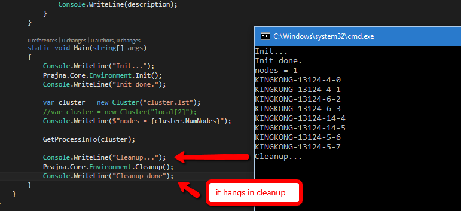

# PrajnaTest: Contributed by Xiang Zhang

This project debugs a Cleanup issue of Prajna that is built from source code.

- Run `build.cmd R` to build it.
- Start Prajna client within the client executable folder without options.
- Open this solution, review the `cluster.lst` file.
- Build and run `PrajnaTest.CS`.

It will hang right after calling into `Cleanup()`. The screenshot is like:

